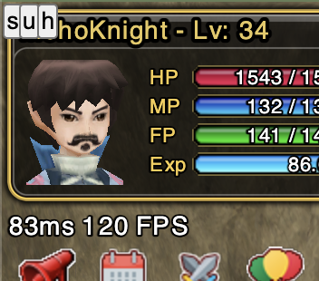
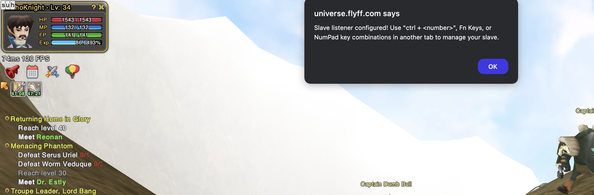
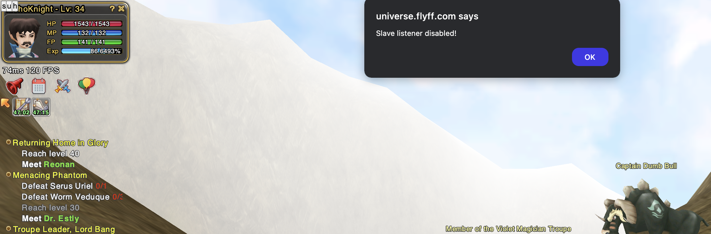
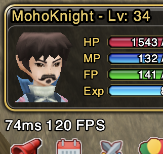

# Flyff universe multi-tab spell caster

A helpful tool for the web browser version of the Flyff Universe to cast spells from another tab.

Use this tool to cast your slave's spells from the tab where you play your master character.

## Installation

1. Install the [Tampermonkey](https://www.tampermonkey.net/) in your favorite web browser.
2. Enable the [Developer mode](https://www.tampermonkey.net/faq.php#Q209) to run user scripts.
3. Go to this [file](https://raw.githubusercontent.com/pPrecel/flyff-universe-multi-tab-spell-caster/main/script.user.js) location and install it. Tampermonkey will automatically detect it.
4. Enjoy.

## Usage

New version of the tool allows to enable it using the `home` key or displayed buttons (in the top left corner).

### Keyboard

1. In the first tab login into your slave account and click the `home` symbol on the keyboard. The tool will communicate that it's ready for instructions.
2. In the second tab login into the master char that you would play. Now you can manage the first account passing the right key combination (key number).
3. You can disable, previously enabled, spells forwarding without relaunching the web tab by clicking the `end` key.

### Buttons

1. In the top left corner are located button that allow to run tool, disable it for this tab and hide buttons:

    

2. To start listening pressed keys from another flyff tab click the `s` (slave) button. It does exactly the same think as the `home` key:

    

3. To disable listener for the tab click the `u` (unslave) button:

    

4. To hide buttons click the `h` (hide) button:

    

## Hints&Tips

1. Slaves should follow master char. You can do it by targeting the master one and pressing `z` on your keyboard.
2. Split your screen between two account tabs. It would give you more control over both chars. Remember this tool is much safer to use than any bot because there is no auto-magic. Still, the game can tell you to react to the captcha.
3. The good idea would be to set the slave's skills on the `ctrl+number` combination to avoid clicking spells on both chars simultaneously.
4. This is useful for using [PowerToys](https://aka.ms/installpowertoys) "Always on Top" feature so that your slave RM can be on top of your main window character in FlyFF.
