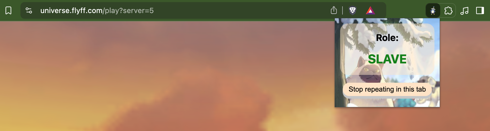
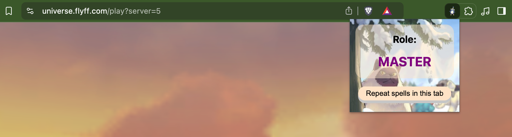

# Flyff universe multi-tab spell caster

A helpful tool for the web browser version of the Flyff Universe to cast spells from another tab.

Use this tool to cast your slave's spells from the tab where you play your master character.

## Installation

Install the `flyff universe multi-tab spell caster` for:

* [Chrome](https://chromewebstore.google.com/detail/flyff-universe-multi-tab/jdkdlbkhhhfhimlabeknoolfiinallah) (or Chrome-based like Brave) browser
* Firefox (WIP)

>**Note:** if you look for version for other browsers install older version of the plugin [here](https://github.com/pPrecel/flyff-universe-multi-tab-spell-caster/blob/main/tampermonkey/README.md).

## Usage

1. In the first tab login into your slave account and click the extension icon in the top right corner of the browser. Then click the `Repeat spells in this tab` button to switch role type to `SLAVE` and start repeating spells in this tab:

    

2. In the second tab login into the master char that you would play. Make sure that in this tab plugin role is set to the `MASTER`:

    

3. You can switch between roles without relaunching the web tab by clicking the `Stop repeating in this tab` button in the extension.

## Hints&Tips

1. Slaves should follow master char. You can do it by targeting the master one and pressing `z` on your keyboard.
2. Split your screen between two account tabs. It would give you more control over both chars. Remember this tool is much safer to use than any bot because there is no auto-magic. Still, the game can tell you to react to the captcha.
3. The good idea would be to set the slave's skills on the `ctrl+number` combination to avoid clicking spells on both chars simultaneously.
